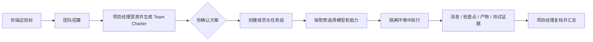

# Goal-Guided Brain

Goal-Guided Brain（简称 **GGB**）是一个面向个人目标的智能协作工作空间。你只需要把目标交给团队招募，项目经理会和你多轮澄清需求，再决定需要几个智能体、每个成员负责什么、使用哪个模型和哪些能力。

GGB 把模型当作可替换的执行引擎，把团队职责、个人习惯、项目知识、权限边界、任务状态和交付证据作为稳定内核。它适合开发、运维、产品规划、资料整理以及需要多个专业角色协作的长期项目。

完整的产品定位、架构、数据模型、接口、权限边界和迭代路线见 [项目全景说明](docs/project-overview.md)。

## 你可以用它做什么

- **团队招募**：直接描述目标，和项目经理多轮讨论，生成可确认的 Team Charter。
- **多团队协作**：为开发、运维、产品或不同项目建立独立团队，团队之间通过项目经理受控委派。
- **模型自由切换**：按团队、角色或单次任务选择 DeepSeek、Gemini、Claude、Codex/OpenAI、Kimi 等模型。
- **能力管理**：安装、固定、启用和回退 Skill、MCP 与 Plugin；智能体只能使用已绑定能力。
- **可恢复执行**：任务组、子任务、消息、检查点、产物、预算、租约和远程节点状态都会持久化。
- **个人工作习惯**：保存语言、时区、语气、详细程度、长期规则和项目知识。
- **可选结构化判断**：TypeSafe System One 可用于路由、风险预评估和人工复核分流，不会替代聊天模型。
- **跨平台 CLI**：通过 `ggb` 在 Windows、macOS 和 Linux 上直接执行或持续对话。

## 工作方式



确认 Team Charter 之前，系统不会把成员说成已经创建，也不会自动分派执行任务。高风险的发布、部署、删除、发送和外部写入仍需要明确授权或人工复核。

同一团队的项目经理按轮次处理消息。上一轮处于排队或执行中时，新的消息会被记录为 `blocked` 并返回 `409`，避免两个项目经理实例同时修改同一份招募上下文；上一轮结束后重新发送即可继续原会话。

## 交付和验收

任务的 `completed` 只表示执行过程结束，不等于已经验收通过。任务详情会保存并展示：

- 执行目录类型、路径、分支和当前状态。
- 未提交变更，以及可选的内部 Git 提交。
- 最近一次验证命令、输出、退出结果和验证产物。
- 任务事件、检查点、交付产物和模型用量。

可以在后台任务或团队动态中打开执行详情，查看变更并运行验证。验证结果会作为独立证据保存；任务仍在运行、目录被隔离或状态未知时，提交和验证操作会自动受限。项目经理的文字总结不能替代这些可检查记录。

## 快速开始

要求 Node.js `22.13+`（建议 `24+`）和 Git。

```bash
npm install
npm run build
npm start
```

打开 <http://127.0.0.1:3088>。API 默认监听 `127.0.0.1:3089`。开发模式使用：

```bash
npm run dev
```

停止本地服务：

```bash
npm run stop
```

首次使用建议：

1. 在“模型管理”中初始化加密凭据库，配置至少一个普通聊天模型。
2. 确认工作目录和 DSH 执行引擎可用。
3. 返回“团队招募”，直接描述你要完成的目标。
4. 检查项目经理生成的 Team Charter、成员职责、模型和能力绑定。
5. 点击“确认创建团队”，再开始执行任务。

## CLI：`ggb`

项目品牌命令是 `ggb`。`dsh`、`dsh-workbench` 和 `goal-guided-brain` 保留为兼容别名。

```bash
npm link

export DEEPSEEK_API_KEY=...
ggb run --provider deepseek --model deepseek-chat "分析当前项目风险"
echo "设计一个缓存方案" | ggb run --provider claude
ggb chat --provider gemini --session personal
ggb providers
```

CLI 支持：

- `ggb run`：执行一次任务，可使用 `--system`、`--no-stream`、`--json`、`--session` 和 `--continue`。
- `ggb chat`：进入持续对话，支持 `/new`、`/model`、`/session`、`/help` 和 `/exit`。
- `ggb providers`：查看普通模型预设和可选 TypeSafe 后端。
- `ggb decide`：向 TypeSafe 发送结构化 `state` 和 `questions`，只返回 JSON 判断结果。

网页中的普通模型选择器不会把 TypeSafe 当作聊天模型；TypeSafe 只通过 `ggb decide`、管理页探测和编排 MCP 的 `evaluate_decision` 使用。

会话默认保存到 `~/.dsh/sessions`，可用 `DSH_SESSION_DIR` 覆盖。密钥只从环境变量或一次性的 `--api-key` 读取，不会自动写入会话文件。

Windows PowerShell 示例：

```powershell
$env:GEMINI_API_KEY = '...'
ggb run --provider gemini "总结这个项目"
```

## 模型配置

普通模型可在网页“模型管理”中保存到加密凭据库，也可以在 CLI 中通过环境变量使用：

| 供应商 | 环境变量 |
| --- | --- |
| DeepSeek | `DEEPSEEK_API_KEY` |
| Kimi | `KIMI_API_KEY` 或 `MOONSHOT_API_KEY` |
| Gemini | `GEMINI_API_KEY` 或 `GOOGLE_API_KEY` |
| Claude | `ANTHROPIC_API_KEY` |
| Codex/OpenAI | `CODEX_API_KEY` 或 `OPENAI_API_KEY` |

网页模型管理支持 DeepSeek、OpenAI Chat Completions、OpenAI Responses 和 Anthropic Messages。供应商配置包括基础地址、凭据引用、模型列表、上下文长度、工具能力、视觉能力和路由优先级。

### TypeSafe 是可选的

[TypeSafe System One](https://docs.typesafe.ai/introduction) 是结构化判断接口，不是聊天或代码生成模型。GGB 将它作为独立的可选决策后端：

```bash
export TYPESAFE_API_KEY=...
ggb decide \
  --state '{"goal":"发布新版本","constraints":["周五前完成"]}' \
  --questions '{"urgent":{"type":"noul","instructions":"Is this urgent?"}}' \
  --json
```

未配置 TypeSafe 时，普通模型、团队招募和开发任务照常运行。TypeSafe 的结果不能代替事实验证、用户确认或高风险操作审批。网页配置建议基础地址为 `https://api.typesafe.ai/v1`，模型使用 `jev-latest`。

## 能力中心

GGB 的 Skill、MCP 和 Plugin 采用显式绑定：

1. 搜索或导入能力来源。
2. 固定版本并保存内容摘要。
3. 检查依赖、健康状态和兼容性。
4. 绑定到角色或团队成员。
5. 任务启动时只注入已绑定且启用的能力。

运行中的智能体可以通过编排 MCP 查看本次实际能力，并调用已经获准的 Plugin 命令。它不能从任务中自行启用未绑定能力，也不能通过消息扩大权限。

## 数据和安全

默认数据目录为 `~/.dsh-workbench/`：

```text
workspace.sqlite       团队、任务、消息、知识、配置和调度
vault.json             Argon2id + AES-256-GCM 加密凭据库
runs/<taskId>/         隔离的执行目录和日志
capabilities/          固定版本的 Skill / Plugin 内容
backups/               SQLite 一致性备份及凭据副本
```

任务使用实例凭证、执行租约和心跳。租约失效、任务暂停、取消或预算超限后，执行权限会被撤销；迟到结果不能覆盖当前状态。MCP 写操作按实例、工具和参数授权，未知的外部操作结果不会自动重试。

公开部署必须使用 HTTPS、登录认证和反向代理，不要直接暴露 3088/3089。Linux 常驻服务、远程节点、Windows WSL2、备份和恢复请查看 [部署说明](deploy/README.md)。

## 文档入口

- [项目全景说明](docs/project-overview.md)：完整产品、架构、接口、权限和路线图。
- [个人智能体方向](docs/personal-agent.md)：个人偏好、记忆边界和模型分工。
- [团队智能体空间](docs/team-agent-workspace.md)：团队招募、成员职责和跨团队协作。
- [Claude Code 与 Pi 设计调研](docs/claude-pi-design-review.md)：可借鉴的 Agent 设计。
- [阶段计划与发布边界](docs/phase-2-plan.md)：已交付能力和未完成验收项。
- [部署说明](deploy/README.md)：控制平面、执行节点、WSL2 和 HTTPS。
- [备份恢复说明](deploy/backup-restore.md)：SQLite 与加密凭据恢复。
- [依赖安全说明](docs/dependency-security.md)：依赖和第三方代码边界。

项目全景说明还记录了任务详情接口、执行目录验收动作和团队消息串行规则；README 只保留最常用的产品和启动说明。

## 开发和发布验证

```bash
npm run lint
npm run typecheck
npm test
npm run build
```

测试使用临时数据库、本地确定性模型和 MCP fixture，不调用付费模型。每次功能迭代都应补充对应验证，检查 `git diff --check`，提交清晰的 Git commit，并推送到远程仓库：

```text
https://github.com/lianjiexu08-ui/Goal-Guided-Brain.git
```

当前项目仍在持续迭代中。真实 Linux、Windows/WSL2、云端 HTTPS、节点离线调度和生产模型质量需要在目标环境中单独验收，不能用本机测试代替。
