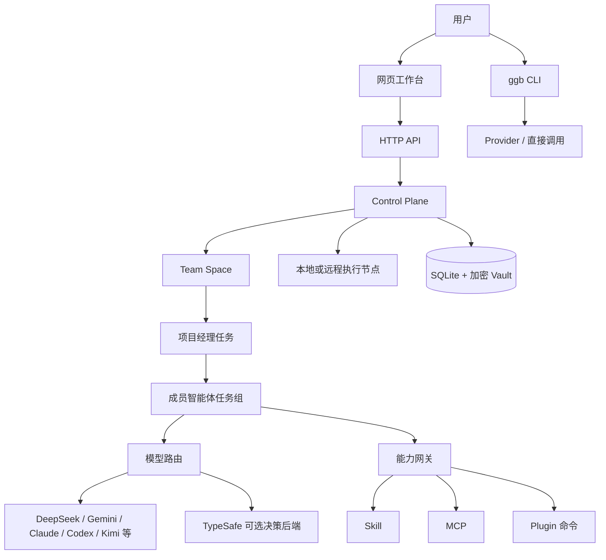

# Goal-Guided Brain

Goal-Guided Brain（简称 **GGB**）是一个面向个人目标的智能协作工作空间。它把用户的需求交给一个可以长期协作的团队，而不是让用户在多个聊天窗口之间来回选择模型。

项目的核心判断是：模型会变化，个人的工作习惯、项目上下文、团队职责、权限边界和验收方式应该稳定。因此 GGB 把模型当作可替换的执行引擎，把团队、任务、能力和证据作为产品内核。

> 本文是项目总览、使用手册和当前架构说明。它描述仓库当前已经实现的行为，也明确列出尚未完成的边界，避免把规划误认为已经交付。

## 目录

- [产品目标](#产品目标)
- [核心概念](#核心概念)
- [整体架构](#整体架构)
- [从需求到交付](#从需求到交付)
- [团队招募](#团队招募)
- [智能体和模型](#智能体和模型)
- [Skill、MCP 和 Plugin](#skillmcp-和-plugin)
- [CLI](#cli)
- [网页工作台](#网页工作台)
- [数据和权限](#数据和权限)
- [接口和集成](#接口和集成)
- [部署和跨平台](#部署和跨平台)
- [开发、测试和发布](#开发测试和发布)
- [当前边界](#当前边界)
- [迭代路线](#迭代路线)

## 产品目标

GGB 主要解决四类问题：

1. 用户只描述目标，不需要先判断应该找产品、开发、运维还是资料助手。
2. 一个团队可以包含多个有明确职责的智能体，每个成员可以使用不同的模型和工具。
3. 团队可以持续讨论、拆解、执行、复核和汇总；团队之间也可以通过项目经理协作。
4. 所有重要动作都留下任务、消息、检查点、产物和验证证据，便于恢复和追踪。

GGB 不把“模型回答得像人”作为唯一目标。一个合格的执行结果还必须说明做了什么、依据是什么、哪些事情没有完成，以及下一步需要谁决定。

### 设计原则

| 原则 | 具体含义 |
| --- | --- |
| 目标优先 | 从用户想达成的结果开始，而不是从模型或工具开始。 |
| 团队优先 | 用户主要和项目经理沟通，成员由项目经理按职责调度。 |
| 模型可替换 | 供应商和模型是路由配置，不绑定某个角色的人格。 |
| 权限最小化 | 助手只能使用已经绑定并获准的 Skill、MCP、Plugin 和工具。 |
| 证据优先 | 任务状态、外部操作和交付物必须有可检查的记录。 |
| 人在回路 | 发布、部署、删除、发送和其他高风险动作仍需要明确授权或复核。 |
| 可恢复 | 任务通过新的执行实例和检查点恢复，不假装恢复已经失联的进程。 |

## 核心概念

| 概念 | 说明 |
| --- | --- |
| 工作空间 | 本地项目、知识、团队和运行数据的边界。默认数据目录为 `~/.dsh-workbench/`。 |
| 团队空间 | 用户与项目经理协作的长期容器。每个团队有目标、职责、成员、预算、工作目录和自治设置。 |
| 角色智能体 | 具有稳定职责的助手模板，例如项目经理、开发、产品和运维。角色不是固定模型。 |
| 成员实例 | 某个角色在某个任务中的一次执行。实例有自己的任务 ID、权限、租约和运行快照。 |
| 任务 | 一次具体目标。任务可以由用户创建，也可以由父任务或跨团队委派创建。 |
| 任务组 | 一个主任务及其子任务、预算、依赖、消息和产物的集合。 |
| 执行尝试 | 任务的一次实际运行。失败重试会创建新的实例，避免覆盖旧结果。 |
| 供应商 | 模型接口配置，包括协议、基础地址、凭据引用、模型列表和优先级。 |
| Skill | 注入给智能体的工作规范和知识文件。 |
| MCP | 通过受控协议暴露工具的服务。工具调用仍受实例权限和参数审批约束。 |
| Plugin | 可安装、固定版本并绑定到助手的能力包，可能包含 Skill、MCP、命令和助手模板。 |
| Team Charter | 项目经理在招募阶段生成的团队方案，包含成员、职责、交付物、模型和能力建议。 |
| 检查点 | 任务的目标、约束、决定、产物、操作和后续步骤，供新实例继续工作。 |

## 整体架构



仓库中的主要实现位置如下：

| 模块 | 文件 | 责任 |
| --- | --- | --- |
| HTTP 入口 | `server/index.mjs` | 认证、请求解析、团队接口、状态接口和 MCP 入口。 |
| 控制平面 | `server/platform.mjs`、`server/control.mjs` | 创建任务、调度、租约、预算、消息和团队协作。 |
| 模型供应商 | `server/providers.mjs` | 保存供应商、凭据引用、能力路由、探测和 TypeSafe 决策请求。 |
| 原生运行时 | `server/runtime.mjs` | 为任务生成隔离运行环境，注入模型、Skill 和能力配置。 |
| 编排 MCP | `server/orchestration-mcp.mjs` | 向运行中的智能体提供任务、团队、消息、能力和检查点工具。 |
| 能力服务 | `server/capabilities.mjs`、`server/capability-gateway.mjs` | 安装、固定、探测和授权 Skill、MCP、Plugin。 |
| 数据层 | `server/store.mjs`、`server/records.mjs`、`server/vault.mjs` | 业务实体、记录、迁移、备份和加密凭据。 |
| 网页 | `app/page.tsx`、`app/management.tsx` | 团队招募、团队动态、任务、助手、模型和能力管理。 |
| CLI | `scripts/cli.mjs` | `ggb run`、`ggb chat`、`ggb providers` 和 `ggb decide`。 |

## 从需求到交付

一次典型工作流如下：

```text
用户描述目标
  → 团队空间保存消息
  → 项目经理读取团队上下文和个人偏好
  → 项目经理多轮澄清目标、约束、交付物和验收标准
  → 生成 Team Charter
  → 用户确认创建团队
  → 项目经理按职责分派子任务
  → 成员使用授权模型、Skill、MCP 和 Plugin 执行
  → 消息、检查点、任务板和产物持续回写
  → 项目经理复核结果和证据
  → 团队空间向用户汇总结果、风险和下一步
```

项目经理不能因为模型的一句话就把成员说成已经创建，也不能把计划当作完成结果。只有 Team Charter 确认、任务状态变化和实际产物记录才能改变对应状态。

任务完成与任务验收是两个状态。任务详情接口会返回执行目录、运行快照、事件、模型用量、产物和最近验证记录；团队动态会在任务行显示验收状态和证据数量；管理界面可以查看差异、保存内部 Git 提交或运行一次明确的验证命令。验证命令的输出会写成 `verification` 产物，便于项目经理和用户复核。提交或验证不会绕过正在运行、已隔离或状态未知的执行实例。

### 四种工作模式

这四种模式描述行为，不是四个固定机器人：

- **咨询**：分析和回答，不修改文件。
- **计划**：整理目标、约束、步骤和验收标准。
- **执行**：在授权范围内读写文件、运行测试和调用工具。
- **复核**：检查差异、测试、产物和证据，默认不扩大修改范围。

同一团队可以先计划，再执行，最后由独立成员或项目经理复核。

## 团队招募

### 招募阶段

团队招募使用三个阶段：

| 阶段 | 行为 | 是否可以分派成员任务 |
| --- | --- | --- |
| `discovery` | 项目经理与用户多轮澄清需求。 | 不可以。 |
| `proposed` | 已保存 Team Charter，等待用户检查。 | 不可以。 |
| `confirmed` | 用户确认方案，成员被配置到团队。 | 可以。 |

### Team Charter 应包含

- 团队名称、目标和长期职责。
- 建议成员数量和每个成员的角色。
- 每个成员的职责、交付物和依赖。
- 每个成员需要的 Skill、MCP、Plugin 和工具权限。
- 候选供应商、模型和纯文本/工具调用要求。
- 未解决的问题和需要用户确认的风险。

确认前，`propose_team` 只保存草案；确认动作由用户在团队界面执行。确认时系统会再次验证成员、能力、供应商、模型和工具兼容性，避免招募过程中配置发生变化导致错误启动。

同一团队的项目经理消息按轮次串行处理。上一条请求处于 `queued` 或 `running` 时，新请求会返回 `409` 并把消息记录为 `blocked`，避免两个项目经理实例同时拆解同一份需求；上一轮完成后重新发送即可继续同一个会话。

### 团队之间协作

团队通过项目经理交接目标，而不是直接共享私有消息。源团队需要允许目标团队，目标团队必须处于活动和已确认状态。目标团队会收到独立任务组，可以使用自己的模型、预算、工作目录和能力配置。

运行中的智能体可以通过编排 MCP 使用：

- `list_teams`：查看当前允许协作的团队摘要。
- `delegate_to_team`：向目标团队项目经理委派目标。
- `read_team_task`：读取获准委派任务的状态和结果。

## 智能体和模型

### 角色与模型分离

角色描述“负责什么”，模型描述“如何执行”。例如：

- 项目经理可使用长上下文、规划能力稳定的模型。
- 开发成员可使用工具调用和代码能力稳定的模型。
- 运维成员可使用低延迟模型处理监控，再用更强模型复核异常。
- 复核成员可以使用不同供应商，减少单一模型判断错误的影响。

用户可以在团队、角色或单次任务上指定模型；未指定时使用候选供应商和优先级路由。

### 当前普通模型协议

- DeepSeek 协议。
- OpenAI Chat Completions。
- OpenAI Responses。
- Anthropic Messages。

路由会检查供应商是否启用、凭据是否存在、模型是否满足工具、视觉和上下文长度要求。网络错误或认证失败可以按候选顺序切换，但已经产生工具副作用的任务不会被整个自动重跑。

### TypeSafe 的可选位置

[TypeSafe System One](https://docs.typesafe.ai/introduction) 是结构化判断接口，不是聊天或代码生成模型。GGB 将它作为独立的可选决策后端：输入 `state` 和带类型的问题，返回 `choice`、`score`、`noul`、概率和置信度。

它可以用于：

- 团队招募中的任务类型和角色需求预评估。
- 任务复杂度、风险和是否需要人工复核的判断。
- 多团队路由前的结构化分类。

它不会替代 DeepSeek、Gemini、Claude、Codex 或 Kimi 的聊天和代码执行。未配置 TypeSafe 时，团队招募和普通任务继续使用当前模型。低置信度和高风险动作仍需要项目经理或用户确认；置信度不是事实证明。

网页配置建议：基础地址 `https://api.typesafe.ai/v1`，模型 `jev-latest`，凭据通过加密凭据库保存。CLI 使用 `TYPESAFE_API_KEY` 和 `ggb decide`。智能体在 TypeSafe 已配置时可通过 MCP 的 `evaluate_decision` 调用它。

## Skill、MCP 和 Plugin

### 能力生命周期

```text
检索来源
  → 查看兼容性和权限
  → 安装指定版本
  → 计算并保存摘要
  → 启用并绑定到角色/团队
  → 启动任务时固定运行快照
  → 探测健康状态
  → 升级、回退或禁用
```

能力中心支持 Skills、MCP Registry、Plugin 和可转换的第三方助手/命令来源。安装成功不代表原平台的所有行为都兼容；界面会展示支持和不支持的部分。

### 运行时边界

- Skill 以固定版本文件注入运行环境。
- MCP 工具通过能力网关连接，按工具名和参数进行授权。
- Plugin 命令通过受控子任务排队，不直接获得父任务之外的权限。
- 智能体可以使用 `list_capabilities` 查看本次执行实际绑定的能力。
- 未绑定、已禁用或版本摘要不匹配的能力不会注入运行时。
- 外部 MCP 的 `readOnlyHint` 只是服务方声明，不是独立的安全证明。

## CLI

需要 Node.js 22.13+。安装依赖后可以使用本地命令，也可以通过 npm 全局链接：

```bash
npm install
npm link
```

品牌命令是 `ggb`，兼容别名是 `dsh`、`dsh-workbench` 和 `goal-guided-brain`。Windows、macOS 和 Linux 都由 npm 生成对应命令入口，不要求 WSL 才能使用 CLI。

### 普通执行

```bash
export DEEPSEEK_API_KEY=...
ggb run --provider deepseek --model deepseek-chat "分析当前项目的风险"
echo "设计一个缓存方案" | ggb run --provider claude
ggb run --provider gemini --no-stream --json "总结这段代码"
```

### 持续对话

```bash
ggb chat --provider claude --session personal
```

交互中支持 `/new`、`/model [供应商/]模型`、`/session`、`/help` 和 `/exit`。会话以 JSONL 保存，`--continue` 可以恢复最近会话；密钥不会写入会话文件。

### 结构化决策

```bash
export TYPESAFE_API_KEY=...
ggb decide \
  --state '{"goal":"发布版本","constraints":["周五前完成"]}' \
  --questions '{"urgent":{"type":"noul","instructions":"Is this urgent?"}}' \
  --json
```

`ggb decide` 只返回结构化 JSON，不会生成聊天回复。TypeSafe 密钥是可选配置，不设置时不影响 `ggb run` 和 `ggb chat`。

### 供应商环境变量

| 供应商 | 默认密钥变量 |
| --- | --- |
| DeepSeek | `DEEPSEEK_API_KEY` |
| Kimi | `KIMI_API_KEY` 或 `MOONSHOT_API_KEY` |
| Gemini | `GEMINI_API_KEY` 或 `GOOGLE_API_KEY` |
| Claude | `ANTHROPIC_API_KEY` |
| Codex/OpenAI | `CODEX_API_KEY` 或 `OPENAI_API_KEY` |
| TypeSafe | `TYPESAFE_API_KEY`（只用于 `decide`） |

也可以通过 `--api-key` 临时传入；临时密钥不会自动写入磁盘。

## 网页工作台

网页主入口是“团队招募”，侧边栏按团队显示长期团队，不再要求用户先选择一个固定助手。主要区域包括：

- **团队招募**：和项目经理多轮澄清，查看 Team Charter 并确认创建。
- **团队动态**：查看成员状态、任务、消息和结果。
- **助手与模型**：管理角色、职责、候选供应商、模型和工具要求。
- **后台任务**：查看任务组、执行记录、检查点、产物和失败原因。
- **能力中心**：安装和管理 Skill、MCP、Plugin。
- **知识库**：管理个人、项目和角色范围的知识。
- **模型管理**：管理加密凭据、供应商、模型和连通性测试。
- **团队高级配置**：设置团队类型、项目经理、成员、工作目录、协作开关和自治模式。

首次使用建议顺序：

1. 打开模型管理，初始化凭据库并保存至少一个普通聊天模型。
2. 确认项目工作目录和执行引擎可用。
3. 返回团队招募，描述目标，不要先手动决定成员数量。
4. 多轮澄清完成后检查 Team Charter。
5. 点击确认创建团队，再让项目经理开始拆解任务。

## 数据和权限

### 数据目录

| 内容 | 默认位置 | 说明 |
| --- | --- | --- |
| SQLite | `~/.dsh-workbench/workspace.sqlite` | 团队、任务、消息、知识、调度和配置。 |
| 加密凭据 | `~/.dsh-workbench/vault.json` | Argon2id 派生密钥和 AES-256-GCM 加密。 |
| 执行目录 | `~/.dsh-workbench/runs/<taskId>/` | 隔离的运行环境、日志和临时文件。 |
| 能力包 | `~/.dsh-workbench/capabilities/` | 固定版本和摘要后的 Skill/Plugin 内容。 |
| 备份 | `~/.dsh-workbench/backups/` | SQLite 一致性备份及凭据副本。 |

可使用 `WORKBENCH_DATA_DIR` 指定数据目录。一个数据目录只允许一个控制平面持有写入锁。

### 权限规则

- 任务实例凭证由系统签发并可撤销，不使用用户 API Key 作为实例身份。
- 实例只能访问自己的任务组、被绑定的能力和被授权的外部操作。
- 团队消息不会自动授予新权限。
- 任务暂停、取消、预算超限或租约过期时，执行权限会被撤销。
- 外部操作使用幂等键；已执行但结果未知的操作不会自动重试。
- 模型、Skill、MCP 和 Plugin 的实际配置会写入运行快照，避免任务中途静默改变行为。
- 日志、消息、产物和错误必须过滤凭据、节点令牌和 Authorization 头。

### 高风险动作

读取、分析和本地验证可以在授权范围内连续完成。发送消息、发布、部署、删除、支付或修改生产系统等动作必须经过明确授权、操作登记和结果记录；模型建议、TypeSafe 置信度和 MCP 的只读声明都不能代替授权。

## 接口和集成

### HTTP API

API 默认监听 `127.0.0.1:3089`，网页默认监听 `127.0.0.1:3088`。除健康检查外需要登录。

| 方法 | 路径 | 用途 |
| --- | --- | --- |
| `GET` | `/api/health` | 健康检查，支持 `HEAD`。 |
| `GET` | `/api/state` | 返回角色、团队、供应商、任务、能力和配置摘要。 |
| `GET/POST` | `/api/teams` | 列出或创建团队；`/api/spaces` 是兼容别名。 |
| `GET/PUT` | `/api/teams/:id` | 查看或更新团队配置、消息和任务。 |
| `POST` | `/api/teams/:id/messages` | 向团队项目经理发送用户需求。 |
| `POST` | `/api/teams/:id/recruitment/confirm` | 用户确认 Team Charter。 |
| `GET` | `/api/teams/:id/collaborators` | 查看允许协作的团队。 |
| `POST` | `/api/teams/:id/collaborate` | 向其他团队项目经理委派协作目标。 |
| `GET/POST/PUT/DELETE` | `/api/providers` | 管理供应商；`POST /api/providers/:id/probe` 做连通性测试。 |
| `GET/POST/PUT/DELETE` | `/api/credentials` | 管理加密凭据库中的引用。 |
| `GET/POST/PUT/DELETE` | `/api/capabilities` | 管理能力包和能力版本。 |
| `POST/PUT` | `/api/roles` | 创建或更新角色智能体；角色列表随 `/api/state` 和 `/api/manage` 返回。 |
| `GET/POST/PUT` | `/api/knowledge` | 管理知识和历史版本。 |
| `POST` | `/api/tasks` | 创建任务；任务控制接口还支持取消和重试。 |
| `GET` | `/api/tasks/:id` | 查看任务、执行目录、运行快照、事件、用量、产物和最近验证。 |
| `GET` | `/api/workspaces/:taskId` | 查看任务执行目录的未提交差异。 |
| `POST` | `/api/workspaces/:taskId/commit` | 保存工作树的内部提交，结果等待复核。 |
| `POST` | `/api/workspaces/:taskId/verify` | 在空闲执行目录中运行验证命令并保存验证产物。 |
| `GET` | `/api/manage` | 返回管理界面所需的聚合数据。 |
| `POST` | `/api/mcp` | 运行实例使用的编排 MCP。 |
| `POST` | `/api/capability-mcp/:id` | 绑定能力的 MCP 工具网关。 |

请求体使用 JSON。远程公开部署必须通过 HTTPS、登录认证和反向代理；不要直接把 3088/3089 暴露到公网。

### 编排 MCP 工具

运行中的智能体可以发现并使用以下类别的工具：

- 能力：`list_capabilities`、`list_capability_catalog`、`run_capability_command`。
- 团队：`list_teams`、`delegate_to_team`、`read_team_task`、`read_team_roster`、`propose_team`。
- 任务：`list_agents`、`delegate_task`、`save_checkpoint`、`submit_artifact`。
- 通信：`read_inbox`、`ack_message`、`send_message`。
- 任务板和关注事项：`read_board`、`update_board`、`request_attention`。
- 外部操作：`begin_operation`、`complete_operation`。
- 可选决策：`evaluate_decision`，只调用已配置的 TypeSafe，不直接执行动作。

### 可调用方式

GGB 目前提供网页、CLI、HTTP API 和 MCP 四个入口。网页、HTTP API 和 MCP 共享服务端 SQLite、凭据库、模型配置和控制平面；CLI 的 `run/chat` 直接调用供应商并用本地 JSONL 保存会话，`decide` 也直接调用 TypeSafe。

## 部署和跨平台

### 本地开发

```bash
npm install
npm run dev
```

开发模式启动 API `3089` 和网页 `3088`。生产模式：

```bash
npm run build
npm start
```

### 控制平面和执行节点

控制平面负责数据库、调度、模型请求和 MCP 网关；执行节点负责实际工作目录中的 DSH 运行。节点通过出站 HTTPS 配对，使用租约、心跳和一次性报告避免重复执行。

- macOS：可以运行本地控制平面和执行节点。
- Linux：适合常驻控制平面和远程执行节点，仓库提供 systemd 模板。
- Windows：CLI 可直接运行；远程执行节点需要在 WSL2 的 Linux 环境中运行。
- 控制平面当前连接外部 stdio MCP，节点本地 stdio MCP 尚未实现。

完整部署步骤见 [deploy/README.md](../deploy/README.md)，备份和恢复见 [deploy/backup-restore.md](../deploy/backup-restore.md)。

## 开发、测试和发布

### 常用命令

```bash
npm run lint
npm run typecheck
npm test
npm run build
```

测试使用临时数据库、本地确定性模型和 MCP fixture，不调用付费模型。覆盖加密凭据、协议认证、模型路由、工具网关、任务租约、消息幂等、团队招募、跨团队协作、工作树、定时任务、通知、恢复和 CLI 会话。

### 每轮迭代要求

1. 先读取当前主分支和工作区状态。
2. 只完成一组可以被验证的相关改动。
3. 为用户可见行为补充或更新测试。
4. 运行与改动相关的测试，再运行完整测试、lint、typecheck 和 build。
5. 检查 `git diff --check` 和敏感信息泄漏。
6. 使用清晰的提交信息提交，并推送到远程 `main`。
7. 在更新中说明提交、验证结果和仍然存在的边界。

### 版本和分支

当前仓库远程地址：

```text
https://github.com/lianjiexu08-ui/Goal-Guided-Brain.git
```

默认分支为 `main`。短期功能迭代使用独立提交；涉及较大实验时使用 `codex/` 前缀分支，合并前保留完整验证记录。

## 当前边界

以下内容已经明确记录为后续工作，不能在产品文案中伪装成已完成：

- 真实 Linux、Windows/WSL2 执行节点的现场验收尚未替代本机测试。
- 真实云端 HTTPS、节点配对和所有者离线时继续调度需要目标基础设施。
- 控制平面的外部 stdio MCP 尚未支持节点本地部署。
- MCP Resources/Prompts、LSP、平台专属界面和部分第三方 Hook 尚未完整兼容。
- TypeSafe 是可选的托管决策接口，不能作为普通聊天模型，也不能被视为事实或审批系统。
- 真实生产模型的质量、价格、限流和可用性需要在用户自己的任务集上评估。

## 迭代路线

### 近期：让团队更像一个可用的个人协作系统

- 让项目经理在招募过程中生成更稳定、可审计的 Team Charter。
- 为任务增加更清晰的风险、阻塞、验收和人工确认状态。
- 让团队动态、任务板、检查点和产物在网页中形成连续的执行时间线。
- 让普通模型、TypeSafe 决策和人工确认组合成可配置的路由策略。
- 改善模型健康状态、失败原因、成本和候选切换的可见性。

### 中期：统一 Agent Core

- 让网页、CLI、后台任务共享同一事件流和上下文压缩策略。
- 支持分支会话、任务恢复和项目级工作规则。
- 为每个工具提供参数预览、审批、结果复核和可重放记录。
- 支持团队模板、团队复制和按项目保存默认成员组合。

### 长期：个人自治工作台

- 在用户设定的预算、时间和权限范围内持续跟踪目标。
- 由多个长期团队互相发现、委派和复核，但不绕过用户的风险边界。
- 通过真实任务证据评估模型、Skill 和团队配置，而不是只依赖模型自评。

## 相关文档

- [个人智能体方向](personal-agent.md)
- [团队智能体空间](team-agent-workspace.md)
- [Claude Code 与 Pi 设计调研](claude-pi-design-review.md)
- [阶段计划与发布边界](phase-2-plan.md)
- [部署说明](../deploy/README.md)
- [依赖安全说明](dependency-security.md)
- [TypeSafe Introduction](https://docs.typesafe.ai/introduction)
